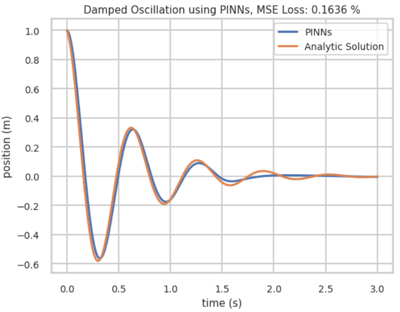
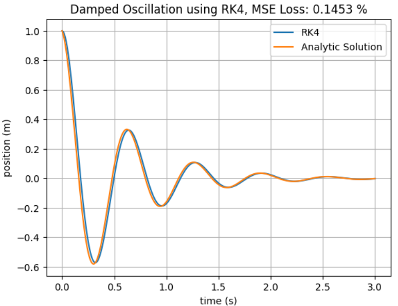

# $\text{PINNs vs. RK4}$

Comparing the **Physics-Informed Neural Networks (PINNs)** method and the **fourth-order Runge–Kutta (RK4)** method to estimate damped oscillatory motion based on **Mean Squared Error (MSE)**.

## $\text{Purpose}$
- Studying the **PINNs** and **RK4** methods in estimating damped oscillatory motion
- Comparing the accuracy of the **PINNs** and **RK4** methods

## $\text{Installation}$ 
Clone repository with
`git clone https://github.com/celfienseptianwp/pinns-vs-rk4.git` and use `pip install -r requirements.txt` in terminal to install dependencies. 

## $\text{Result}$
<p align="center">
  
  
</p>

The following table presents a comparison of **Mean Squared Error (MSE)** accuracy between the **Physics-Informed Neural Networks (PINNs)** method and the **RK4** method:
| Method | MSE (%) |
|---------|----------|
| PINNs | 0.1636 |
| RK4 | 0.1453 |

From these results, it can be observed that **RK4** achieves higher accuracy compared to **PINNs**.

## $\text{Folder Structure}$
```text
├── assets/
│   ├── PINNs.png
│   └── RK4.png
├── pinns.ipynb
├── README.md
├── requirements.txt
└── rk4.ipynb
```

## $\text{References}$
- Thuerey, N., Holzschuh, B., Holl, P., Kohl, G., Lino, M., Liu, Q., Schnell, P., & Trost, F. (2021–2025). Integrating DP into NN Training. In Physics-based Deep Learning: Differentiable Physics Examples. Physics-based Deep Learning. Retrieved from https://physicsbaseddeeplearning.org/diffphys-examples.html
- Runge-Kutta: SHORT Explanation + Python script [Video]. (2022, June 7). YouTube. https://youtu.be/C_WsQeOjbV4

## $\text{Licence}$
This project uses the MIT License.


